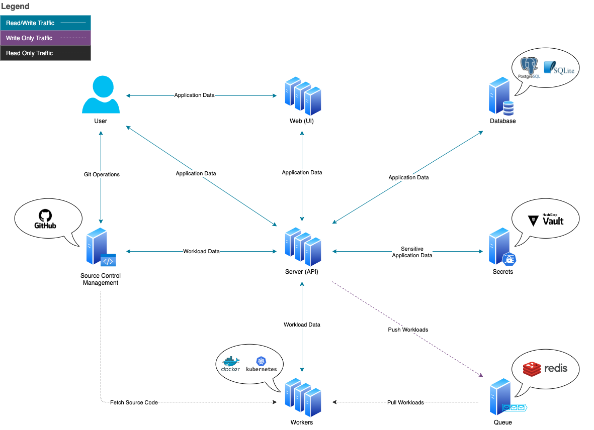

Vela is an open-source, Pipeline Automation ([CI/CD](https://www.redhat.com/en/topics/devops/what-is-ci-cd)) platform built on [Linux container](https://linuxcontainers.org/) technology.

A Vela cluster is deployed as a self-hosted solution and consists of two core services, the [server](/docs/administration/server/) and the [worker](/docs/administration/worker/). The relationship between these services is considered many-to-many meaning many workers can connect to many servers.

The server is considered the brains of the application while the worker is considered the brawn of the application.

An optional third service, the [ui](/docs/administration/ui/), can also be deployed but is not required for the Vela platform to operate as intended. This service provides a means for utilizing and interacting with the Vela platform.

## Services

There are 3 core services that make up Vela:
